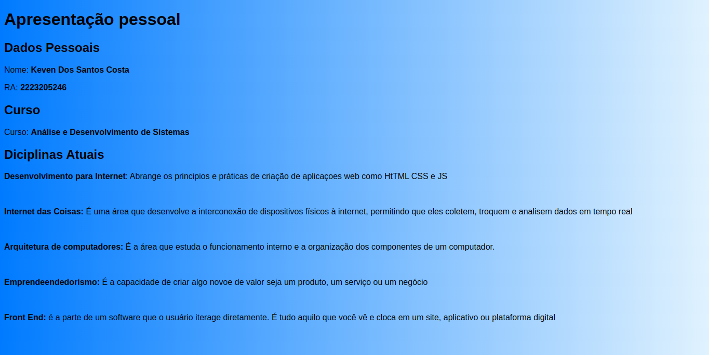

# Repositório de Atividades - Desenvolvimento para Internet

Este repositório contém os códigos das atividades desenvolvidas durante a disciplina Desenvolvimento para Internet. 

## 🚀 Tecnologias Utilizadas
  

### Atividade 2 - Página de Apresentação Pessoal
Uma página web minimalista com informações acadêmicas e profissionais, desenvolvida em HTML e CSS.

>Link da visualisação da aplicação: https://keven-costa.github.io/desenvolvimento-para-internet/atividade-02/
>

### Atividade 3 - Página Interativa com Efeitos de Cor
Uma página simples com HTML, CSS e JavaScript que demonstra interatividade básica, permitindo alterar a cor dos parágrafos aleatoriamente.

>Link da visualisação da aplicação: https://keven-costa.github.io/desenvolvimento-para-internet/atividade-03/pages/
>

### Atividade 4 - Galeria de Imagens Interativa
Uma página simples que permite trocar conjuntos de imagens com um único botão, desenvolvida com HTML, CSS e JavaScript.

>Link da visualisação da aplicação: https://keven-costa.github.io/desenvolvimento-para-internet/atividade-03/pages/
>

### Atividade 5 - Artigo Educativo sobre Java

Uma página simples falando sobre o Java, suas características, portabilidade e boas práticas de programação.

>Link da visualisação da aplicação: https://keven-costa.github.io/desenvolvimento-para-internet/atividade-05/page/
>

### Atividade 7 - Clonagem de Layout
**Objetivo**: Recriar uma página 

> Link da visualização da aplicação ex2 : https://keven-costa.github.io/desenvolvimento-para-internet/atividade-07/ex2/index.html?authuser=0
>

**Objetivo:** Reproduzir um layout de 3 cards.

> Link da visualização da aplicação ex2 : https://keven-costa.github.io/desenvolvimento-para-internet/atividade-07/ex2/index.html?authuser=0
>

### Atividade 8 - Clonagem de Layout

**Objetivo:** Reproduzir um layout

> Link da visualização da aplicação. https://keven-costa.github.io/desenvolvimento-para-internet/atividade-08/pages/

### Atividade 9 - Uma simples página interativa

  Uma simples página interativa que utiliza CSS Grid para organizar elementos de forma responsiva. A página apresenta um título e uma instrução para que o usuário passe o mouse sobre os elementos dispostos em uma grade. Cada elemento, numerado de 1 a 5, é estilizado para ter um fundo colorido e, ao passar o mouse, eles aumentam de tamanho, criando um efeito visual dinâmico.

> Link da visualização da aplicação. https://keven-costa.github.io/desenvolvimento-para-internet/atividade-09/pages/
>

### Atividade 9 - Uma simples página de portfólio pessoal.

Uma simples página de portfólio pessoal. A página contém um cabeçalho com o título do portfólio e um menu de navegação que permite ao usuário acessar rapidamente as seções "Sobre", "Projetos" e "Contato".

> Link da visualização da aplicação. https://keven-costa.github.io/desenvolvimento-para-internet/atividade-10/

### Atividade 12 - Página Web Simples Sobre Motocicletas

Este projeto consiste em uma página web sobre motocicletas, construída e estilizada com Bootstrap.

> Link da visualização da aplicação. https://keven-costa.github.io/desenvolvimento-para-internet/atividade-12/