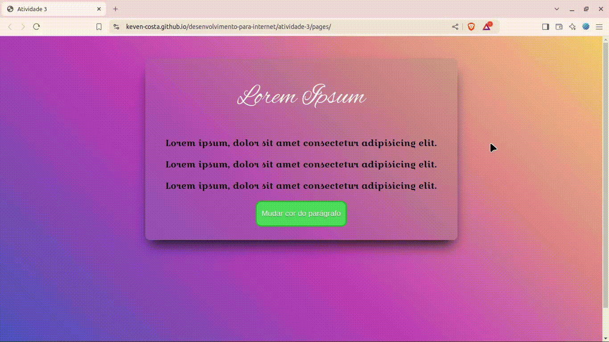

# Atividade 3

 


> Status do Projeto: :heavy_check_mark: concluido

### Tópicos 

:small_blue_diamond: [Descrição do projeto](#descrição-do-projeto)

:small_blue_diamond: [Funcionalidades](#funcionalidades)

:small_blue_diamond: [Visualização da Aplicação](#visualização-da-aplicação-dash)

:small_blue_diamond: [Como rodar a aplicação](#como-rodar-a-aplicação-arrow_forward)


## Descrição do projeto 
<p align="justify">
  Uma página simples com três parágrafos e um botão para mudar a cor dos parágrafos. 
</p>

## Funcionalidades

:heavy_check_mark: Botão para mudar a cor do parágrafo  

 

## Visualização da Aplicação :dash:


> Link da visualização da aplicação. https://keven-costa.github.io/desenvolvimento-para-internet/atividade-03/pages/


## Como rodar a aplicação :arrow_forward:

No terminal, clone o projeto: 

```
git@github.com:Keven-Costa/desenvolvimento-para-internet.git
```
navegue até a pasta:
```bash
cd atividade-03
```

## Licença 

The [MIT License]() (MIT)

Copyright :copyright: 2024 - Atividade 03