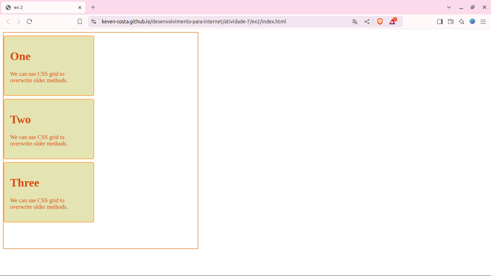

# Atividade 07

 


> Status do Projeto: :heavy_check_mark: concluido

### Tópicos 

:small_blue_diamond: [Descrição do projeto](#descrição-do-projeto)


:small_blue_diamond: [Visualização da Aplicação](#visualização-da-aplicação-dash)

:small_blue_diamond: [Como rodar a aplicação](#como-rodar-a-aplicação-arrow_forward)


## Descrição do projeto 
<p align="justify">
Ex1: Este projeto é uma página  simples que apresenta informações sobre raposas. A estrutura inclui um título, uma seção para exibir uma imagem  uma raposa , e um parágrafo.
</p>
<p align="justify">
Ex2: Este projeto consiste em uma página que demonstra o uso do CSS Grid para organizar o layout. A estrutura é composta por um contêiner principal que abriga três seções, cada uma com um título e uma breve descrição.
</p>


## Visualização da Aplicação :dash:



> Link da visualização da aplicação ex1: https://keven-costa.github.io/desenvolvimento-para-internet/atividade-07/ex1/index.html?authuser=0
>

> Link da visualização da aplicação ex2 : https://keven-costa.github.io/desenvolvimento-para-internet/atividade-07/ex2/index.html?authuser=0
>


## Como rodar a aplicação :arrow_forward:

No terminal, clone o projeto: 

```
git@github.com:Keven-Costa/desenvolvimento-para-internet.git
```
navegue até a pasta:
```bash
cd atividade-07
```

## Licença 

The [MIT License]() (MIT)

Copyright :copyright: 2024 - Atividade 07