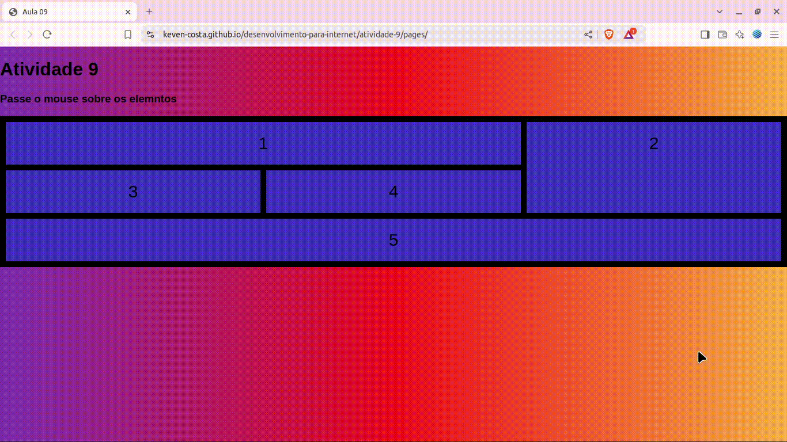

# Atividade 09

 


> Status do Projeto: :heavy_check_mark: concluido

### Tópicos 

:small_blue_diamond: [Descrição do projeto](#descrição-do-projeto)

:small_blue_diamond: [Visualização da Aplicação](#visualização-da-aplicação-dash)

:small_blue_diamond: [Como rodar a aplicação](#como-rodar-a-aplicação-arrow_forward)


## Descrição do projeto 
<p align="justify">
  Uma simples página interativa que utiliza CSS Grid para organizar elementos de forma responsiva. A página apresenta um título e uma instrução para que o usuário passe o mouse sobre os elementos dispostos em uma grade. Cada elemento, numerado de 1 a 5, é estilizado para ter um fundo colorido e, ao passar o mouse, eles aumentam de tamanho, criando um efeito visual dinâmico.

O estilo da página inclui um gradiente de fundo vibrante e uma estrutura de grid com espaçamentos definidos. A transição suave para o efeito de hover proporciona uma experiência interativa agradável.
</p>

 

## Visualização da Aplicação :dash:


> Link da visualização da aplicação. https://keven-costa.github.io/desenvolvimento-para-internet/atividade-09/pages/


## Como rodar a aplicação :arrow_forward:

No terminal, clone o projeto: 

```
git@github.com:Keven-Costa/desenvolvimento-para-internet.git
```
navegue até a pasta:
```bash
cd atividade-09
```

## Licença 

The [MIT License]() (MIT)

Copyright :copyright: 2024 - Atividade 09